# TASKER Complete Application Design Blueprint & Architecture Specification

> **Target Version**: v1.0.20  
> **Framework**: React 18 + Vite + TypeScript + Tailwind CSS + Capacitor Android + Supabase  
> **Design Philosophy**: High-performance Executive ERP (Linear / SAP style) with Zero Clutter, Pure English UI, Dual Scope (Personal + Workplace), and Real-time Multi-tenant Collaboration.

---

## 1. Global Design System & Foundations

### 1.1 Color Palette & Semantic Tokens
The interface utilizes a tailored palette based on Tailwind CSS with custom elevations for Dark (`#090d16`) and Light (`#f8fafc`) modes:

| Semantic Role | Light Mode | Dark Mode | Usage / Meaning |
|---|---|---|---|
| **Canvas Background** | `bg-slate-50` (`#f8fafc`) | `bg-[#090d16]` | Base screen background |
| **Surface / Card Background** | `bg-white` (`#ffffff`) | `bg-slate-900` (`#0f172a`) | Cards, modals, sidebars, panels |
| **Sub-surface / Alt Row** | `bg-slate-50/80` | `bg-slate-800/60` | Table headers, secondary blocks, inputs |
| **Borders** | `border-slate-200/80` | `border-slate-800` | Subtle, crisp structural dividers |
| **Primary Accent** | `bg-blue-600` / `text-blue-600` | `bg-blue-500` / `text-blue-400` | Main buttons, active tabs, highlights |
| **Success / Completed** | `bg-emerald-500` / `text-emerald-700` | `bg-emerald-600` / `text-emerald-300` | Done state, photo proof, verified |
| **Warning / Pending** | `bg-amber-500` / `text-amber-700` | `bg-amber-600` / `text-amber-300` | Pending tasks, awaiting handover |
| **Critical / Overdue / Bin** | `bg-rose-500` / `text-rose-700` | `bg-rose-600` / `text-rose-400` | Overdue deadlines, destructive actions |
| **Workplace / Org Accent** | `bg-purple-600` / `text-purple-700` | `bg-purple-500` / `text-purple-300` | Enterprise badge, assignments, sites |

### 1.2 Typography & Tone
- **Font Stack**: Inter, -apple-system, BlinkMacSystemFont, Segoe UI, Roboto.
- **Language**: English locked across the UI (clean executive terminology).
- **Rules**: Micro-labels (like redundant `(By: ...)` or repetitive subtitles) are removed to maintain an uncluttered ERP feel.

---

## 2. Information Architecture & Navigation

The application is structured into 4 distinct architectural layers:

```mermaid
graph TD
    App[TASKER App] --> Auth[Authentication & Recovery]
    App --> PublicShare[Public Shared Task Page]
    App --> Personal[Personal Workspace Layer]
    App --> Workplace[Enterprise Workplace Layer]
    App --> PlatformAdmin[Platform Super-Admin Area]

    Personal --> Dash[Dashboard]
    Personal --> Pending[Pending Tasks]
    Personal --> AllTasks[All Tasks]
    Personal --> Completed[Completed Archive]
    Personal --> Bin[Bin & Recovery]
    Personal --> TaskDetail[Task Details & Activity]
    Personal --> Settings[Settings & Profile]

    Workplace --> OrgTasks[Workplace Tasks & Sites]
    Workplace --> OrgPending[Site-Wise Pending Tasks]
    Workplace --> Subtasks[Subtask Delegation A->B->C]
    Workplace --> AssignedMe[Assigned to Me]
    Workplace --> CreatedMe[Created by Me]
    Workplace --> EmpDir[Employee Directory]
    Workplace --> AsgnHist[Assignment History]
    Workplace --> OrgMgmt[Organization Management]
    Workplace --> Notifs[Notifications Inbox]

    PlatformAdmin --> AdminDash[Platform KPI Analytics]
    PlatformAdmin --> AdminUsers[Central User Management]
    PlatformAdmin --> AdminOrgs[Multi-Org Governance]
    PlatformAdmin --> AdminMembers[Cross-Org Members]
    PlatformAdmin --> AdminAudit[Security Audit Trail]
```

---

## 3. Screen-by-Screen Blueprint & UX Specifications

### 3.1 Authentication & Onboarding
- **Component**: `AuthModal.tsx` & `src/components/ui/auth-switch.tsx`
- **Route**: Rendered by `ProtectedRoute.tsx` when unauthenticated.
- **Header**: Animated TASKER logo, branding subtitle.
- **AuthSwitch Header**:
  - Segmented pill slider with `Sign In` (LogIn icon) and `Create Account` (UserPlus icon).
  - Smooth animation with elevated active state.
- **Sign In Form**:
  - Email input with Mail icon.
  - Password input with Eye/EyeOff toggle.
  - "Forgot Password?" trigger (opens OTP / reset link view).
  - Primary button: "Sign In" with ArrowRight.
- **Create Account Form**:
  - Name, Email, Password (min 6 chars), Confirm Password.
  - Organization join / invite code optional input.
  - Primary button: "Create Account".
- **Success Brand Transition**:
  - 1.2s branded splash screen with pulsing logo and personal greeting before dashboard mount.

---

### 3.2 Personal Workspace Screens

#### 1. Dashboard (`/`) — `DashboardPage.tsx`
- **KPI Summary Grid**:
  - `Pending Tasks`: Total active pending count with Clock icon.
  - `Urgent / High Priority`: Count of high-attention items.
  - `Overdue Tasks`: Flagged red with warning badge.
  - `Completed Today / Total`: Productivity counter.
- **Quick Action Bar**:
  - `+ New Task` button (opens `TaskFormModal`).
  - Search input with live debounced filtering.
  - Smart voice mic input (`VoiceMicModal`).
- **Section 1: Critical & Overdue**: Cards requiring immediate attention.
- **Section 2: Active Pending Tasks**: Grouped with `TaskCard` component.
- **Section 3: Recent Activity**: Audit trail of updates and remarks.

#### 2. Pending Tasks (`/pending`) — `PendingTasksPage.tsx`
- **Filter Toolbar**:
  - Priority filter (All, Urgent, High, Medium, Low).
  - Person filter ("Pending with").
  - Date filter (Today, This Week, Overdue, All).
  - Quick Search.
- **Card Grid**: Clean task cards with:
  - Title, priority pill, due date badge.
  - "Pending with: [Name]" indicator.
  - "Done with Proof" 1-click completion button.

#### 3. All Tasks (`/tasks`) — `AllTasksPage.tsx`
- Complete repository of all user tasks with multi-field sorting:
  - Newest, Oldest, Due Date, Priority, Pending Duration.
- View switchers: Card Grid vs Compact List View.

#### 4. Completed Archive (`/completed`) — `CompletedTasksPage.tsx`
- Completed task logs with completion timestamp, actor name, verification remarks, and photo/log book attachments preview.

#### 5. Bin & Recovery (`/bin`) — `BinPage.tsx`
- Displays soft-deleted tasks (`is_deleted: true`).
- Action buttons on each card:
  - `Restore`: Restores task back to active list.
  - `Delete Permanently`: Hard delete with double confirmation.
- Top action: "Empty Bin".

#### 6. Settings (`/settings`) — `SettingsPage.tsx`
- Clean ERP English settings:
  - User profile & email display.
  - Theme mode toggle (System / Dark / Light).
  - App Update Manager (In-app APK updater check, version display).
  - Local cache reset & offline sync status.
  - Logout trigger with confirmation dialog.

---

### 3.3 Task Details Page (`/tasks/:id` & `/org/tasks/:id`) — `TaskDetailPage.tsx`

This is the centerpiece of the application, featuring the **Enterprise Subtask & Delegation Engine**:

1. **Top Navigation Bar**:
   - `Back` navigation arrow.
   - Action controls: `Share`, `Assign`, `Edit`, `Change Status`, `Done with Proof / Log Book`, `Delete` (if permitted).

2. **Delegated Subtask Focused Banner (For User C)**:
   - Displayed when viewing a delegated subtask (`parent_task_id` exists):
   - Blue gradient header: **"Delegated Action Item"**.
   - Context: **Main Project / Task: [Parent Title]**.
   - Delegator: **Delegated by: [Name]**.
   - Clear Deliverable Requirement: `[task.title]`.
   - Primary CTA: **"Attach Log Book & Complete"** (opens `QuickCompleteModal`).

3. **Main Task Overview Card**:
   - Status badge, Priority pill, Scope badge (`🏢 Workplace` / `👤 Personal`).
   - Task Title & detailed description.
   - Assignee & "Pending with" status.
   - Dates: Created at, Due date, Pending duration, Last updated.
   - Smart Reminders panel (Snooze, Stop, Enable).

4. **Two-Column Layout**:
   - **Left Column (2/3 width)**:
     - **Delegated Subtasks & Action Items (`TaskSubtasks.tsx`)**:
       - Progress bar: e.g. `1 of 2 Completed (50%)`.
       - `+ Delegate Subtask` button (opens `DelegateSubtaskModal.tsx`).
       - Subtask cards listing Assignee C, deliverable title, due date, status pill.
       - **Attached Proof & Log Book viewer**: Embedded chips with filename, size, and 1-click Download / Signed URL preview.
     - **Notes & Remarks (`TaskNotes.tsx`)**: Chronological remarks feed.
     - **Attached Files (`TaskAttachments.tsx`)**: File drop zone, PDF/Word/Image list.
   - **Right Column (1/3 width)**:
     - **Assignment History (`TaskAssignmentModal.tsx`)**: Step-by-step handover log.
     - **Status History Timeline (`StatusTimeline.tsx`)**: Audit trail of all state transitions.

---

### 3.4 Enterprise Workplace & Multi-Site Collaboration

#### 1. Workplace Tasks & Site Switcher (`/org/tasks`) — `OrgTasksPage.tsx`
- **Header**: Organization name (e.g. Rachana) with member count and role.
- **Site Switcher Bar**:
  - Buttons: `All Sites`, `VTR Site`, `18 B Site`, `+ Add Site`.
  - Filter by selected site.
- **Top Toggle Tabs**:
  - `All Tasks` (grid of all workplace assignments).
  - `Pending by Site` (redirects to `/org/pending`).
- **Primary CTA**: `+ Create Workplace Task` (supports site assignment and employee selection).

#### 2. Site-Wise Pending Tasks (`/org/pending`) — `OrgPendingTasksPage.tsx`
- **KPI Stats Header**: Total Pending, Urgent Pending, Overdue.
- **Smart Site Isolation Logic**:
  - If user is assigned to a single site (e.g. 18 B): Automatically locked to that site.
  - If user is Admin / Owner / multi-site: Dropdown selector with site badges.
- **Pending Task Cards**: Executive layout showing assignee name, site badge, due date, and 1-click `Done with Photo` button.

#### 3. Subtask Delegation Workflow (A -> B -> C):
- **User A (Creator)** assigns main task to **User B (Assignee)**.
- Either A or B clicks **"+ Delegate Subtask"**:
  - Selects team member **C** from directory.
  - Inputs deliverable (e.g. "Attach Log Book", "Upload Site Photos").
  - Sets due date and instructions.
- **User C** sees only the concise deliverable and parent project context in their task list.
- **User C** clicks "Done with Log Book", attaches PDF/scanned image, and completes task.
- **Users A & B** both receive real-time push & in-app notifications and see C's attached log book immediately in the parent task.

#### 4. Employee Directory (`/org/employees`) — `EmployeeDirectoryPage.tsx`
- Grid of registered employees / team members with avatar, designation, email, phone, and active tasks count.
- `+ Add Employee` quick registration modal.

#### 5. Assignment History (`/org/history`) — `AssignmentHistoryPage.tsx`
- Audit log of every task handover, delegation, reassignment, and completion remark across the organization.

#### 6. Organization Management (`/org/manage`) — `OrgManagementPage.tsx`
- Organization profile (name, slug, logo).
- Sites manager (create site, assign users to sites).
- Member join requests & approvals.
- Invite code generation.

#### 7. Notifications Inbox (`/org/notifications`) — `NotificationsPage.tsx`
- Feed of in-app notifications: task assignments, delegations, completions, and reminders.
- Read/Unread filters and "Mark All as Read" button.

---

### 3.5 Central Super-Admin Platform Area (`/admin`)

Governed by `AdminRoute.tsx` (checks `is_platform_admin(auth.uid())` in Supabase):

1. **Admin Dashboard (`/admin`)**:
   - Total Platform Users, Total Organizations, Active Tasks, System Health KPI cards.
2. **User Governance (`/admin/users`)**:
   - Searchable directory of all registered users in the database.
   - User migration across organizations.
   - Role promotion / demotion.
3. **Organizations Manager (`/admin/organizations`)**:
   - Master list of all companies / orgs.
   - Create, rename, transfer ownership, or archive organizations.
4. **Platform Requests (`/admin/requests`)**:
   - Cross-org membership approvals.
5. **Security & Audit Logs (`/admin/audit`)**:
   - Platform-level audit trail of all administrative actions.

---

## 4. Key Modals & Dialogs

| Modal Name | File Path | Purpose & Form Fields |
|---|---|---|
| **Task Form Modal** | `src/components/tasks/TaskFormModal.tsx` | Create/Edit task: Title, Description, Priority, Due Date, Pending with, Scope, Site, Org. |
| **Delegate Subtask Modal** | `src/components/tasks/DelegateSubtaskModal.tsx` | Delegate subtask to C: Assignee picker, Deliverable requirement chips, Due date, Instructions. |
| **Quick Complete Modal** | `src/components/tasks/QuickCompleteModal.tsx` | Complete with proof: Live camera photo OR Document/Log Book upload (PDF/Word/Excel) + remarks. |
| **Task Assignment Modal** | `src/components/tasks/TaskAssignmentModal.tsx` | Reassign task: Select employee, Handover remark, audit logging. |
| **Change Status Modal** | `src/components/tasks/ChangeStatusModal.tsx` | Change status between Pending, In Progress, Completed, Cancelled + audit remarks. |
| **Task Share Modal** | `src/components/tasks/TaskShareModal.tsx` | Generate secret read-only share link or WhatsApp formatted message. |
| **Voice Mic Modal** | `src/components/tasks/VoiceMicModal.tsx` | Multilingual AI voice input to dictate task details. |
| **Confirm Dialog** | `src/components/common/ConfirmDialog.tsx` | Standardized destructive action confirmation. |

---

## 5. UI Component Library (`src/components/ui/`)

- `auth-switch.tsx`: Interactive Sign-In / Create Account toggle slider with smooth animations.
- `liquid-glass-button.tsx`: High-end glassmorphic interactive button with liquid glow effects.
- `premium-auth.tsx`: Standalone multi-step registration component with password strength meter.
- `demo.tsx`: Interactive preview harness.

---

## 6. Recommendations for Future Redesign

When executing a new visual redesign, consider:
1. **Preserve Database Contracts**: Keep `tasks.parent_task_id`, `custom_fields`, `org_id`, and `site_id` intact to maintain zero data loss.
2. **Component Modularity**: Reuse existing hooks (`useAuth`, `useEnterprise`, `useTask`) while updating UI components in `src/components/`.
3. **Mobile-First Touch Ergonomics**: Keep action buttons within thumb zones (bottom sheets and sticky footers on mobile screens).
4. **ERP Aesthetic**: Retain high data density with clean card separators, subtle borders (`border-slate-200/80`), and high-contrast typography.
