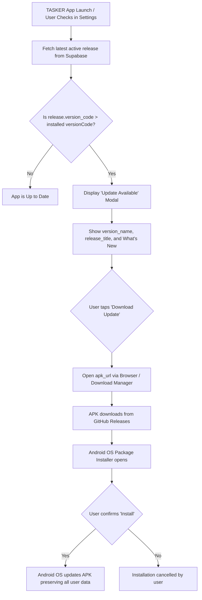

# TASKER Android App Update & Release Infrastructure Guide

This guide defines the end-to-end architecture, release lifecycle, versioning strategy, and distribution procedures for the **TASKER** Android application (`com.oneclicksolution.tasker`).

---

## 0. One-Command Automated Release Pipeline (`npm run release`)

TASKER provides a fully automated, end-to-end release pipeline via:
```powershell
npm.cmd run release
```

### What `npm run release` executes automatically in a single command:
1. **Validates Environment**: Checks `.env`, Git status, GitHub credentials, and Supabase service role access.
2. **Computes Next Version**: Automatically calculates monotonically increasing `versionCode` (+1) and increments patch version (`1.0.2` -> `1.0.3`).
3. **Conflict Detection**: Verifies that neither the version name nor versionCode already exists in Supabase `app_releases` or GitHub Releases.
4. **Synchronizes Version Metadata**: Updates `package.json`, `android/app/build.gradle`, and in-app service fallbacks.
5. **Compiles Web Bundle**: Runs `npm.cmd run build` (`tsc -b && vite build`).
6. **Synchronizes Capacitor**: Runs `npx.cmd cap sync android`.
7. **Compiles Signed Android APK**: Executes Gradle `.\gradlew.bat assembleRelease -x lint` using the existing key.
8. **Generates Named Artifacts**: Produces `release/TASKER-vX.Y.Z.apk` and `TASKER-vX.Y.Z.apk`.
9. **Uploads to Supabase Storage**: Automatically uploads the APK to the public bucket `app-releases` as `TASKER-vX.Y.Z.apk` and updates `app-release.apk`.
10. **Registers in Supabase Database**: Automatically upserts the release record in `public.app_releases` with public download URL.
11. **Publishes GitHub Release**: Creates tag `vX.Y.Z` and uploads `TASKER-vX.Y.Z.apk` asset.
12. **Pushes to Git**: Safely stages version files, commits, and pushes to `origin/main` (never staging secrets, `.env`, or APK binaries).

### Optional Command-Line Flags:
```powershell
npm.cmd run release                      # Standard patch bump (e.g. 1.0.2 -> 1.0.3)
npm.cmd run release -- --type minor      # Minor release (e.g. 1.1.0)
npm.cmd run release -- --type major      # Major release (e.g. 2.0.0)
npm.cmd run release -- --version 1.0.5   # Explicit version override
npm.cmd run release -- --notes "..."     # Custom release notes
npm.cmd run release -- --mandatory       # Mark release as mandatory
npm.cmd run release -- --dry-run         # Test preflight checks and validations without modifying files
```

---

## 1. Versioning Strategy & Increment Procedure

TASKER adheres strictly to Semantic Versioning (`MAJOR.MINOR.PATCH`) for public version names and a monotonically increasing integer for Android `versionCode`.

### Core Versioning Rules:
- **`versionName`**: Human-readable string displayed to users (e.g., `"1.0.0"`, `"1.0.1"`, `"1.1.0"`).
- **`versionCode`**: Internal integer required by the Android OS to determine whether an APK is newer than the currently installed version.
- **Strict Monotonic Increase**: `versionCode` **MUST ALWAYS** increase by at least `+1` with every single APK build intended for distribution.
  > **Android Enforcement**: If an APK has a `versionCode` less than or equal to the installed APK's `versionCode`, the Android package manager rejects the update with `INSTALL_FAILED_VERSION_DOWNGRADE`.
- **Never Decrement or Reuse**: Once a `versionCode` is published or distributed, it can **never** be used again.

### Release Progression Table:

| Release Type | `versionName` | `versionCode` | Description |
| :--- | :--- | :--- | :--- |
| **Initial Release** | `1.0.0` | `1` | Baseline Android release |
| **Patch / Hotfix** | `1.0.1` | `2` | Bug fixes, visual tweaks, stability improvements |
| **Minor Feature** | `1.1.0` | `3` | New features, enhanced offline caching, filter upgrades |
| **Maintenance** | `1.1.1` | `4` | Performance updates and library updates |
| **Major Release** | `2.0.0` | `5` | Major architectural overhaul or milestone features |

### Files to Update When Incrementing Version:

1. **`package.json`**:
   ```json
   {
     "name": "my-work-tracker",
     "version": "1.0.1",
     ...
   }
   ```

2. **`android/app/build.gradle`**:
   Inside `android.defaultConfig`:
   ```groovy
   defaultConfig {
       applicationId "com.oneclicksolution.tasker"
       minSdkVersion rootProject.ext.minSdkVersion
       targetSdkVersion rootProject.ext.targetSdkVersion
       versionCode 2
       versionName "1.0.1"
       testInstrumentationRunner "androidx.test.runner.AndroidJUnitRunner"
       ...
   }
   ```

---

## 2. How to Build the APK

Before building the Android APK, all web assets must be built and synchronized into the Android project.

### Step 1: Build Web Production Assets
From the project root:
```powershell
npm.cmd run build
```
This compiles TypeScript and packages the Vite bundle into the `dist/` directory.

### Step 2: Synchronize Assets with Capacitor
```powershell
npx cap sync android
```
This copies `dist/` into `android/app/src/main/assets/public/` and updates Capacitor native plugins.

### Step 3: Compile the Android APK via Gradle

**For Debug / Testing APK:**
```powershell
cd android
.\gradlew.bat assembleDebug
```

**For Production Release APK:**
```powershell
cd android
.\gradlew.bat assembleRelease
```

---

## 3. Exact APK Output Paths

After the Gradle build finishes, the generated APK files are located at:

- **Debug APK**:
  ```
  c:\Users\aghug\Desktop\TASKER\android\app\build\outputs\apk\debug\app-debug.apk
  ```
- **Release APK (Unsigned)**:
  ```
  c:\Users\aghug\Desktop\TASKER\android\app\build\outputs\apk\release\app-release-unsigned.apk
  ```
- **Release APK (Signed with Keystore)**:
  ```
  c:\Users\aghug\Desktop\TASKER\android\app\build\outputs\apk\release\app-release.apk
  ```

---

## 4. How to Create a GitHub Release

TASKER APKs are hosted on the official GitHub repository:
`https://github.com/khandagalesuraj48-sys/TASKER`

### Option A: Using GitHub Web Interface

1. Navigate to: `https://github.com/khandagalesuraj48-sys/TASKER/releases`
2. Click **"Draft a new release"**.
3. Choose a tag: Type `v1.0.1` and click **"Create new tag: v1.0.1 on publish"**.
4. Target: `main`.
5. Release title: `TASKER v1.0.1`.
6. Description: Paste the release notes (see Section 6).
7. Attach binaries: Drag and drop the renamed APK: `TASKER-v1.0.1.apk`.
8. Click **"Publish release"**.

### Option B: Using GitHub CLI (`gh`)

```powershell
# Rename the artifact to the standardized name
Copy-Item android\app\build\outputs\apk\debug\app-debug.apk .\TASKER-v1.0.1.apk

# Create release and upload asset
gh release create v1.0.1 .\TASKER-v1.0.1.apk `
  --title "TASKER v1.0.1" `
  --notes "Release notes for version 1.0.1"
```

---

## 5. APK Asset Naming Convention

All release APK assets uploaded to GitHub **MUST** follow this explicit convention:

```
TASKER-v{MAJOR}.{MINOR}.{PATCH}.apk
```

### Examples:
- `TASKER-v1.0.0.apk`
- `TASKER-v1.0.1.apk`
- `TASKER-v1.1.0.apk`

### Direct Download URL Format:
GitHub Releases provides predictable direct asset URLs:
```
https://github.com/khandagalesuraj48-sys/TASKER/releases/download/v{version_name}/TASKER-v{version_name}.apk
```
*Example:*
`https://github.com/khandagalesuraj48-sys/TASKER/releases/download/v1.0.1/TASKER-v1.0.1.apk`

---

## 6. How to Write Release Notes

Release notes should be clear, user-focused, and structured consistently.

### Standard Markdown Template:

```markdown
## What's New in TASKER v1.0.1

### ✨ Improvements & Features
- Modern edge-to-edge layout with transparent Android navigation and status bar.
- Enhanced hardware Back button navigation flow for modals, drawers, and detail panels.
- Optimized performance for task search and status history timeline.

### 🐛 Bug Fixes
- Resolved issue where universal search modal occasionally retained search query after dismiss.
- Fixed keyboard avoidance on compact Android displays.

### 📱 Android Requirements
- Minimum Android Version: Android 5.1 (Lollipop, API 22)
- Target Android Version: Android 14 (API 34)
- Package ID: `com.oneclicksolution.tasker`
```

---

## 7. Supabase Release Metadata Architecture (Proposed)

Supabase serves as the lightweight, real-time metadata registry for published versions. When the app starts, it checks Supabase to discover whether an update is available.

> [!IMPORTANT]
> **NO DATABASE MODIFICATIONS HAVE BEEN MADE YET.**
> The following table structure is the proposed specification. It will only be applied after explicit user review and authorization.

### Proposed Table Schema: `public.app_releases`

```sql
-- PROPOSAL ONLY: To be reviewed and approved before execution.
CREATE TABLE IF NOT EXISTS public.app_releases (
    id UUID PRIMARY KEY DEFAULT gen_random_uuid(),
    version_name TEXT NOT NULL,                -- e.g. '1.0.1'
    version_code INTEGER NOT NULL UNIQUE,      -- e.g. 2
    release_title TEXT NOT NULL,               -- e.g. 'TASKER v1.0.1 - Navigation & Edge-to-Edge'
    release_notes TEXT NOT NULL,               -- Markdown description of changes
    apk_url TEXT NOT NULL,                     -- Direct GitHub Releases download link
    minimum_version TEXT DEFAULT '1.0.0',      -- Lowest supported version
    is_mandatory BOOLEAN DEFAULT false,        -- Set true to require immediate update
    is_active BOOLEAN DEFAULT true,            -- Set true for currently promoted release
    created_at TIMESTAMPTZ DEFAULT now()
);

-- Index for fast version lookups
CREATE INDEX IF NOT EXISTS idx_app_releases_active_code 
ON public.app_releases (is_active, version_code DESC);

-- Enable Row-Level Security
ALTER TABLE public.app_releases ENABLE ROW LEVEL SECURITY;

-- Read Policy: Anyone (anon + authenticated) can view releases to check for updates
CREATE POLICY "Public read app releases"
ON public.app_releases
FOR SELECT
TO anon, authenticated
USING (true);

-- Write Policy: Only service-role / database administrators can insert or update releases
-- (Default deny for anon and authenticated users)
```

### Why This Table Is Safe:
1. **Isolated & Standalone**: It has no foreign keys to `tasks`, `task_notes`, `task_attachments`, `task_reminders`, or `auth.users`.
2. **Zero Impact on Production Records**: Creating this table cannot delete, modify, lock, or corrupt any existing user tasks, notes, or files.
3. **Public Read-Only Security**: Anonymous and authenticated clients can only execute `SELECT`. No client can alter release information without the backend service key.

---

## 8. Client In-App Update Check Flow



### Safety & Permission Principles:
- **NO Silent / Auto-Installation**: The application will **NEVER** silently install packages in the background.
- **Android OS Verification**: The installation is always handed off to Android's official system package installer (`com.android.packageinstaller`), ensuring:
  - User explicitly sees what app is updating.
  - User explicitly taps "Install".
  - Android verifies cryptographic signature consistency.

---

## 9. Rollback & Emergency Recovery Procedure

If a release (e.g., `v1.2.0` with `versionCode: 12`) contains a critical bug:

1. **Do NOT Re-use or Decrement Version Codes**:
   - Downgrading `versionCode` to `11` will fail on all devices that already downloaded `12`.
2. **Restore Stable Codebase**:
   - Revert git to the stable commit (`v1.1.0`).
3. **Publish Rollback Release with HIGHER Version Code**:
   - Set `versionName` to `"1.2.1"`.
   - Set `versionCode` to `13` (higher than the faulty `12`).
4. **Compile and Upload to GitHub**:
   - Build `TASKER-v1.2.1.apk`.
   - Create GitHub Release `v1.2.1`.
5. **Update Supabase Metadata**:
   - Update release `12`: `is_active = false`.
   - Insert release `13`: `is_active = true`, `is_mandatory = true`, `apk_url = '...'`.
6. **Result**:
   - All devices running the faulty version `12` see that version `13` is available and update cleanly.

---

## 10. Security Guarantees & Secret Protection

- **Zero Credentials in Code**: Neither GitHub personal access tokens nor Supabase service-role keys are placed in client code, environment files, or git commits.
- **Public Read, Admin Write**: Release metadata is publicly readable via Supabase anon key, but write/update permissions require direct admin/service role access.
- **HTTPS Only**: All APK downloads are served exclusively over encrypted HTTPS from GitHub Releases (`github.com`).
- **Signature Integrity**: APK updates can only overwrite installed instances if both APKs are signed with the same keystore/key certificate.

---

## 11. Production Data Safety Statement

**Updating the TASKER Android APK has ZERO effect on Supabase production data.**

- **Data Decoupling**: All user tasks, status histories, attachments, and reminders reside securely in Supabase PostgreSQL and Supabase Storage.
- **Seamless Continuity**: Updating the APK updates only the local web/native shell bundle on the user's phone.
- **Session Preservation**: Supabase authentication tokens stored in secure local storage persist across APK updates when signed with the same key. The user does not even need to re-login after an APK update.
- **No Data Reset**: An APK release never triggers database migrations, table drops, or record deletions.

